# Web dinamis
**Web dinamis** merupakan sebuah **website** yang memungkinkan penggunanya untuk berinteraksi secara langsung, dalam artian pengguna dapat menambah, memodifikasi, ataupun menghapus konten di dalam sebuah **web** tanpa harus membuka struktur kode dari **web** tersebut
# Apa Itu PHP
PHP adalah untuk **membangun situs web yang dinamis**. Dengan PHP,dapat membuat halaman web yang dapat berinteraksi dengan pengguna, menampilkan konten yang berubah secara real-time, dan mengakses basis data untuk mengambil atau menyimpan informasi
# Program Pertama
## Cara 
1. Buka XAMPP, kemudian klik tombol start pada 'apache'
2. Open file manager
3. Open di Drive D
4. Kemudian Open folder XAMPP
5. Lalu open folder htdocs
6. Buat folder baru di dalam htdocs 
7. Lalu open folder yang sudah Anda buat
8. Open VSCode
9. Open folder yang sudah Anda buat di VSCode
10. Buat file baru di VSCode dengan ekstensi .php di folder yang sudah Anda buka
# PHP Dasar
## Echo 
### Penggunaan Dasar:
   1. - echo adalah perintah dasar dalam PHP yang digunakan untuk menampilkan teks atau nilai pada halaman web.
   - Anda dapat menggunakan echo untuk menampilkan teks statis atau untuk menampilkan nilai dari variabel atau ekspresi.
   - echo dapat menerima satu atau lebih argumen yang dipisahkan oleh tanda titik (.) untuk menggabungkan teks dan variabel.

2. Menampilkan Teks
   - Anda dapat menggunakan echo untuk langsung menampilkan teks statis dalam tanda kutip ganda ("") atau tanda kutip tunggal ('').
   - Contoh: echo `"Halo, dunia!";`

3. Menampilkan Nilai Variabel
   - Anda dapat menggunakan echo untuk menampilkan nilai dari variabel dalam teks yang ditampilkan.
   - Gunakan operator konkatenasi (tanda titik) untuk menggabungkan teks dan variabel.
   - Contoh: 
```php
$nama = "John Doe";
echo "Halo, nama saya " . $nama . "."; 

```

4. Menampilkan HTML:
   - Selain teks, Anda juga dapat menggunakan echo untuk menampilkan kode HTML di dalam skrip PHP.
   - Uji coba berikut menunjukkan penggunaan echo untuk menampilkan elemen HTML:
```php
echo "``<h1>Selamat Datang!</h1>``";
echo "`<p>Ini adalah halaman web PHP.</p>";
```

5. Penggunaan Kutipan:
   - Anda dapat menggunakan tanda kutip ganda ("") atau tanda kutip tunggal ('') untuk mengelilingi teks dalam echo.
   - Misalnya, echo `"Halo, nama saya 'John'.";`

6. Menggunakan Pemisah:
   - Saat menggunakan echo dengan beberapa argumen, Anda dapat menggunakan koma (,) sebagai pemisah antara argumen.
   - Contoh: echo `"Halo,", " nama saya ", $nama, ".";`
### Struktur dasar echo
1. <?php dan ?>: Adalah penanda awal dan akhir dari blok kode PHP. Semua kode PHP harus berada di antara penanda ini agar dapat dieksekusi dengan benar.
2. `echo:` Adalah perintah dalam PHP yang digunakan untuk menampilkan teks atau nilai ke dalam halaman web.
3. `teks atau nilai yang ingin ditampilkan:` Adalah bagian di mana Anda memasukkan teks statis, nilai variabel, atau ekspresi matematika yang ingin ditampilkan di halaman web.

Jadi, ketika kode tersebut dieksekusi, teks atau nilai yang ditentukan akan ditampilkan di halaman web sebagai hasil dari perintah echo.

#### Kode program

```
```php
<?php
    echo "Halo, dunia!";
?>
```
#### Hasil
## Komentar
**Komentar** adalah **bagian kode yang tidak dieksekusi ketika suatu program dijalankan**

- singgle line = menggunakan strip 2 (//)
- multible line = menggunakan strip dan bintang  (/*)

```php
/// ini komentar singgle linne
```

```php
/* ini
komentar multible line
*/
```

## Variable
**Variabel** adalah **konsep penting dalam pemrograman PHP (dan dalam pemrograman secara umum).** **Mereka digunakan untuk menyimpan dan mengelola data  sementara yang akan digunakan dalam program**.

Dalam PHP, variabel bersifat dinamis, yang berarti Anda tidak perlu mendeklarasikan tipe data variabel sebelum menggunakannya. PHP akan secara otomatis menentukan tipe data variabel berdasarkan nilai yang Anda berikan.

Simbol `$` pada PHP digunakan untuk menandakan sebuah variabel. Dalam PHP, setiap kali Anda ingin membuat, mengakses, atau memanipulasi nilai variabel, Anda perlu menggunakan simbol `$`diikuti dengan nama variabelnya.

Contoh penggunaan variabel pada PHP:
```php
$nama = "John Doe"; // Variabel $nama dengan nilai "John Doe"
$umur = 25; // Variabel $umur dengan nilai 25
$gaji = 2500.50; // Variabel $gaji dengan nilai 2500.50
$isActive = true; // Variabel $isActive dengan nilai true
```

## Const
**Const**  (konstan) **dalam pemrograman** adalah kata kunci yang mendefinisikan suatu variabel atau pointer sebagai sesuatu yang tidak dapat diubah. **Const** dapat diterapkan **dalam** deklarasi objek untuk menunjukkan bahwa objek, tidak seperti variabel standar , tidak berubah. Nilai tetap untuk objek sering disebut literal. 
-  Konstanta didefinisikan menggunakan kata kunci const diikuti dengan nama konstanta dan nilainya.
- Nama konstanta biasanya ditulis dalam huruf besar (uppercase) untuk membedakan dengan variabel biasa.
- Nilai konstanta dapat berupa bilangan, string, boolean, atau ekspresi konstan lainnya.
Contoh :
```php
	const PI = 3.14;
    const NAMA_SITUS = "Website ABC";
    const STATUS_AKTIF = true;
    ```

## Operator
**Operator** merupakan **simbol yang dipakai ketika membuat program agar bisa melakukan perintah seperti penjumlahan hingga pemberian nilai ke variabel**. Sebuah nilai yang dipakai untuk dioperasikan oleh operator disebut dengan operand atau argumen yang berbentuk ekspresi.

Berikut ini beberapa jenis operator yang tersedia dalam PHP:
### Operator Aritmatika
   - Operator aritmatika digunakan untuk melakukan operasi matematika seperti penjumlahan, pengurangan, perkalian, pembagian, modulus, dan sebagainya.
   - Contoh:
```php
     $a = 10;
     $b = 5;
     $c = $a + $b; // Penjumlahan
     $d = $a - $b; // Pengurangan
     $e = $a * $b; // Perkalian
     $f = $a / $b; // Pembagian
     $g = $a % $b; // Modulus (sisa pembagian)
```

### Operator Penugasan
   - Operator penugasan digunakan untuk memberikan nilai ke variabel.
   - Contoh:
 ```php
    $a = 10; // Penugasan nilai 10 ke variabel $a
     $b += 5; // Penugasan nilai $b + 5 ke variabel $b (sama dengan $b = $b + 5)
```

### Operator Perbandingan
   - Operator pembanding digunakan untuk membandingkan dua nilai dan menghasilkan nilai kebenaran (true atau false).
   - Contoh:
```php
     $a = 10;
     $b = 5;
     $c = $a == $b; // Sama dengan
     $d = $a != $b; // Tidak sama dengan
     $e = $a > $b; // Lebih besar dari
     $f = $a < $b; // Lebih kecil dari
     $g = $a >= $b; // Lebih besar dari atau sama dengan
     $h = $a <= $b; // Lebih kecil dari atau sama dengan    
```

### Operator Logika
   - Operator logika digunakan untuk menggabungkan atau memanipulasi nilai kebenaran (true atau false).
   - Contoh:
```php
     $a = true;
     $b = false;
     $c = $a && $b; // Logika AND
     $d = $a || $b; // Logika OR
     $e = !$a; // Logika NOT
```

### Operator String
   - Operator string digunakan untuk menggabungkan atau memanipulasi teks.
   - Contoh:
``` php
     $a = "Hello, ";
     $b = "World!";
     $c = $a . $b; // Penggabungan teks
```
     

## Conditional statement
### If
#### Penjelasan
pernyataan if digunakan untuk mengimplementasikan kondisi. Ini memungkinkan Anda untuk menjalankan serangkaian kode tertentu jika kondisi yang diberikan terpenuhi.

#### Struktur
```php
if (kondisi) {
    // Kode yang dijalankan jika kondisi benar
}
```

#### Program
```php
$nilai = 80;
if ($nilai >= 70) {
    echo "Nilai Anda lulus.";
}
```
#### Hasil
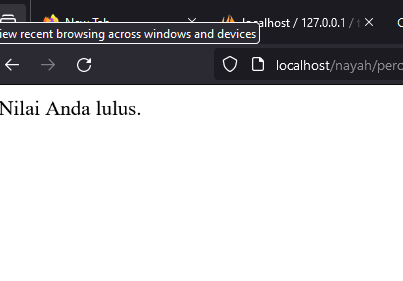
#### Analisis
- Baris 1: Sebuah variabel $nilai diinisialisasi dengan nilai 80.
- Baris 2: Kondisi dievaluasi, yaitu apakah nilai $nilai lebih besar atau sama dengan 70.
- Baris 3: Karena kondisi benar (true), maka blok kode di dalam IF dieksekusi.
- Baris 4: Mencetak teks "Nilai Anda lulus." karena nilai $nilai memenuhi kondisi.

#### Kesimpulan
Program akan mencetak "Nilai Anda lulus." karena nilai $nilai adalah 80, yang lebih besar dari atau sama dengan 70.

### If-Else
#### Penjelasan
else dalam PHP digunakan untuk menentukan blok kode yang akan dieksekusi jika kondisi dalam pernyataan if sebelumnya tidak terpenuhi atau bernilai false. Ini memungkinkan program untuk menjalankan tindakan alternatif ketika kondisi if tidak terpenuhi.

#### Struktur
```PHP
if (kondisi) {
    // Kode yang dijalankan jika kondisi benar
} else {
    // Kode yang dijalankan jika kondisi salah
}
```

#### Program
```PHP
<?php
// Analisis
// Program ini menerima input berupa angka dan menampilkan pesan tergantung pada nilai angka tersebut.

$nilai = 75; // Contoh nilai input

// Pernyataan if
if ($nilai >= 80) {
    echo "Selamat! Anda lulus dengan nilai yang baik.";
} else {
    echo "Maaf, Anda tidak lulus.";
}
```

#### Hasil
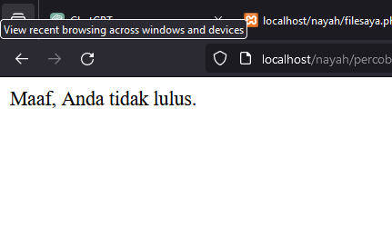

#### Analisis
Dalam analisis, program akan mengevaluasi kondisi secara berurutan. Jika $nilai lebih besar atau sama dengan 80, program akan menampilkan pesan "Selamat! Anda lulus dengan nilai yang baik.". Jika ya, program akan menampilkan pesan "Anda lulus.". Jika kedua kondisi sebelumnya tidak terpenuhi, program akan menjalankan blok kode dalam pernyataan else dan menampilkan pesan "Maaf, Anda tidak lulus.".

#### Kesimpulan
Program ini menggunakan pernyataan if untuk menguji nilai input. Jika nilai input lebih besar atau sama dengan 80, program akan menampilkan pesan "Selamat! Anda lulus dengan nilai yang baik." Jika nilai input lebih besar atau sama dengan 60, program akan menampilkan pesan "Anda lulus." Jika nilai input kurang dari 60, program akan menampilkan pesan "Maaf, Anda tidak lulus." Dalam contoh ini, dengan nilai input 75, program akan menampilkan pesan "Anda lulus."

### If-ElseIf-Else
#### Penjelasan
truktur kontrol if-elseif-else digunakan dalam pemrograman untuk membuat keputusan berdasarkan kondisi yang diberikan. Ini memungkinkan program untuk mengevaluasi ekspresi dan menjalankan serangkaian pernyataan berdasarkan hasil evaluasi kondisi tersebut.
- `if`: Pernyataan `if` pertama mengevaluasi kondisi. Jika kondisinya benar (true), blok pernyataan yang terkait akan dieksekusi. Jika tidak, program akan melanjutkan ke pernyataan `elseif` atau `else`, jika ada.
- `elseif`: Jika kondisi pada pernyataan `if` sebelumnya tidak terpenuhi, maka program akan mengevaluasi kondisi pada pernyataan `elseif`. Jika kondisi `elseif` benar, blok pernyataan yang terkait akan dieksekusi. Program kemudian keluar dari struktur if-elseif-else.
- `else`: Jika tidak ada kondisi pada pernyataan `if` atau `elseif` yang benar, blok pernyataan di dalam `else` akan dieksekusi.
- 
#### Struktur
```php
if (kondisi1) {
    // blok kode yang dieksekusi jika kondisi1 bernilai true
} elseif (kondisi2) {
    // blok kode yang dieksekusi jika kondisi2 bernilai true
} else {
    // blok kode yang dieksekusi jika semua kondisi sebelumnya bernilai false
}
```

#### Program
```php
$nilai = 75;
if ($nilai >= 90) {
    echo "Nilai Anda A.";
} elseif ($nilai >= 80) {
    echo "Nilai Anda B.";
} elseif ($nilai >= 70) {
    echo "Nilai Anda C.";
} elseif ($nilai >= 60) {
    echo "Nilai Anda D.";
} else {
    echo "Nilai Anda E.";
}
```

#### Hasil
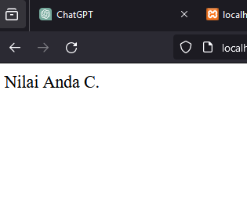

#### Analisis
1. Nilai yang diberikan adalah 75.
2. Program mengevaluasi nilai dengan serangkaian pernyataan `if`, `elif` (else if), dan `else`.
3. Pernyataan `if` pertama mengecek apakah nilai lebih besar dari 90. Karena tidak, program melanjutkan ke pernyataan `elif` berikutnya.
4. Pernyataan `elif` kedua mengecek apakah nilai lebih besar dari 80. Karena tidak, program kembali melanjutkan ke pernyataan `elif` berikutnya.
5. Pernyataan `elif` ketiga mengecek apakah nilai lebih besar dari 70. Karena nilai 75 memenuhi kondisi ini, maka blok pernyataan terkait dengan pernyataan `elif` ketiga akan dieksekusi.
6. Setelah blok pernyataan dijalankan, program keluar dari struktur if-elif-else.

#### Kesimpulan 
1. Struktur kontrol if-elif-else memungkinkan pengecekan kondisi secara berurutan dan memberikan respons sesuai dengan kondisi yang pertama kali terpenuhi.
2. Meskipun nilai 75 tidak memenuhi kondisi pada pernyataan `if` dan `elif` pertama dan kedua, nilai tersebut memenuhi kondisi pada pernyataan `elif` ketiga, sehingga program menjalankan blok pernyataan terkait dengan pernyataan `elif` ketiga.
3. Dalam konteks skala penilaian, nilai 75 diperoleh grade "C" sesuai dengan kriteria yang ditetapkan dalam program.
4. Penting untuk memperhatikan urutan kondisi dalam struktur if-elif-else. Jika kondisi yang lebih spesifik ditempatkan di awal, maka kondisi yang lebih umum mungkin tidak akan pernah dievaluasi.
### Switch-Case
#### Penjelasan
`Switch-case` adalah sebuah pernyataan kondisional yang digunakan dalam pemrograman untuk mengevaluasi ekspresi tunggal terhadap sejumlah nilai yang mungkin. Pernyataan switch-case memungkinkan program untuk memutuskan aliran eksekusi berdasarkan nilai ekspresi tersebut.

#### Struktur
```php
switch ($ekspresi) {
    case nilai1:
        // pernyataan yang akan dieksekusi jika $ekspresi sama dengan nilai1
        break;
    case nilai2:
        // pernyataan yang akan dieksekusi jika $ekspresi sama dengan nilai2
        break;
    case nilai3:
        // pernyataan yang akan dieksekusi jika $ekspresi sama dengan nilai3
        break;
    default:
        // pernyataan yang akan dieksekusi jika tidak ada kesesuaian dengan kasus sebelumnya
}
```

#### Kode Program
```php
$nilai = 2;
switch ($nilai) {
    case 1:
        echo "Nilai adalah 1";
        break;
    case 2:
        echo "Nilai adalah 2";
        break;
    case 3:
        echo "Nilai adalah 3";
        break;
    default:
        echo "Nilai tidak ditemukan";
}
```

#### Hasil
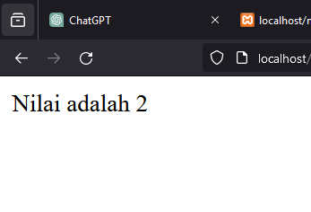

#### Analisis
Variabel `$nilai` diinisialisasi dengan nilai 2.
Program memeriksa nilai dari variabel `$nilai` dalam blok `switch ($nilai)`.
Program mengevaluasi `case` pertama:    
- `case 1:` Program memeriksa apakah nilai variabel `$nilai` adalah 1. Karena `$nilai` bukan 1, maka program tidak menjalankan kode dalam `case 1`.
Program mengevaluasi `case` kedua:    
- `case 2:` Karena nilai variabel `$nilai` adalah 2, program menjalankan kode dalam `case 2`.
- Program mencetak "Nilai adalah 2".
- Setelah itu, program menemukan pernyataan `break`, sehingga keluar dari blok `switch`.
Karena sudah ada kecocokan dengan `case 2`, program tidak mengevaluasi `case` lainnya.    
Eksekusi program selesai setelah mencetak pesan "Nilai adalah 2".

#### Kesimpulan
Jadi, secara keseluruhan, saat nilai variabel `$nilai` adalah 2, program akan mencetak "Nilai adalah 2" dan kemudian keluar dari blok `switch`. Karena tidak ada kecocokan dengan `case` lainnya, program tidak mengeksekusi kode di dalam `case` lain atau `default`.

## Array
### Array 1 Dimensi
#### Penjelasan
Sebuah `array satu dimensi` adalah struktur data yang dapat menyimpan sejumlah elemen data, di mana setiap elemen memiliki indeks yang unik. Dalam array satu dimensi, elemen-elemennya disusun dalam satu baris atau satu dimensi.

#### Struktur
```php
$array = [nilai1, nilai2, nilai3, ...];
```

#### Kode program
```php
$buah = ["Apel", "Pisang", "Jeruk", "Anggur", "Mangga"];
echo $buah[0]; 
echo $buah[1]; 
echo $buah[2];
echo $buah[3];
echo $buah[4];
```

#### Hasil
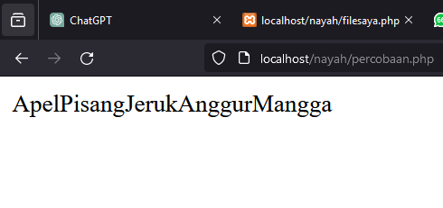

#### Analisis
1. `$buah = ["Apel", "Pisang", "Jeruk", "Anggur", "Mangga"];`:    
    - Pernyataan ini membuat sebuah array dengan nama variabel `$buah`.
    - Array tersebut berisi lima elemen, yaitu "Apel", "Pisang", "Jeruk", "Anggur", dan "Mangga".
2. `echo $buah[0];`:
    - Ini adalah perintah untuk mencetak elemen pertama dari array `$buah`.
    - Karena indeks array dimulai dari 0, `$buah[0]` akan mencetak "Apel".
3. `echo $buah[1];`:    
    - Ini adalah perintah untuk mencetak elemen kedua dari array `$buah`.
    - `$buah[1]` akan mencetak "Pisang".
4. `echo $buah[2];`:    
    - Ini adalah perintah untuk mencetak elemen ketiga dari array `$buah`.
    - `$buah[2]` akan mencetak "Jeruk".
5. `echo $buah[3];`:    
    - Ini adalah perintah untuk mencetak elemen keempat dari array `$buah`.
    - `$buah[3]` akan mencetak "Anggur".
6. `echo $buah[4];`:    
    - Ini adalah perintah untuk mencetak elemen kelima (terakhir) dari array `$buah`.
    - `$buah[4]` akan mencetak "Mangga".
    
#### Kesimpulan
Jadi, secara keseluruhan, program tersebut membuat array yang berisi daftar nama-nama buah, dan kemudian mencetak setiap elemen dari array tersebut satu per satu secara berurutan.

### Array Asosiatif
#### Penjelasan
`Array asosiatif` adalah struktur data di mana setiap elemen dalam array memiliki kunci atau label yang terkait dengannya, bukan hanya indeks numerik seperti pada array biasa. Ini memungkinkan kita untuk menyimpan data dalam bentuk pasangan "kunci-nilai".

#### Struktur
```php
$array = [
    'kunci1' => nilai1,
    'kunci2' => nilai2,
    'kunci3' => nilai3,
    // dan seterusnya
];
```

#### Kode program
```php
$kontak = [
    'nama' => 'John Doe',
    'email' => 'john@example.com',
    'telepon' => '123-456-7890'
];
echo $kontak['nama']; 
echo $kontak['email'];  
echo $kontak['telepon'];
```

#### Hasil
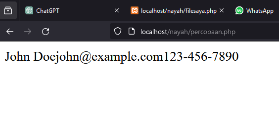

#### Analisis
1. `$kontak['nama']` mengembalikan nilai `'John Doe'`, yang merupakan nama kontak.
2. ` $kontak['email']` mengembalikan nilai `'john@example.com'`, yang merupakan alamat email kontak.
3. `$kontak['telepon']` mengembalikan nilai `'123-456-7890'`, yang merupakan nomor telepon kontak.
4. `echo $kontak['nama'];`: Ini adalah perintah untuk mencetak nilai yang disimpan dalam array `$kontak` pada kunci atau indeks `'nama'`. Jadi, jika `$kontak['nama']` mengandung nilai misalnya "John Doe", perintah ini akan mencetak "John Doe" ke output.
5. `echo $kontak['email'];`: Ini adalah perintah yang mirip dengan yang pertama, tetapi mencetak nilai yang disimpan dalam array `$kontak` pada kunci atau indeks `'email'`. Jika, misalnya, `$kontak['email']` mengandung nilai "john@example.com", perintah ini akan mencetak "john@example.com" ke output.
6. `echo $kontak['telepon'];`: Sekali lagi, ini adalah perintah yang mirip dengan dua sebelumnya, tetapi kali ini mencetak nilai yang disimpan dalam array `$kontak` pada kunci atau indeks `'telepon'`. Jika, misalnya, `$kontak['telepon']` mengandung nilai "123-456-7890", perintah ini akan mencetak "123-456-7890" ke output.

#### Kesimpulan
Jadi, kode tersebut bertujuan untuk membuat, mengakses, dan mencetak informasi kontak yang disimpan dalam array asosiatif.
### Array Multidimensi 
#### Penjelasan
Array multidimensi adalah array yang memiliki satu atau lebih array di dalamnya. Hal ini memungkinkan kita untuk membuat struktur data yang kompleks, seperti matriks.

#### Struktur program
```php
$nama_array = array(     
array(nilai1, nilai2, nilai3, ...),     
array(nilai1, nilai2, nilai3, ...),     
... );
```

#### Kode Program
```php
$matriks = array(  
array(1, 2, 3),  
array(4, 5, 6),
array(7, 8, 9) ); 
echo $matriks[1][2]; // Mengakses nilai 6
```

#### Hasil
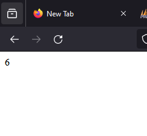

#### Analisis
- Baris 1-3: Membuat array $matriks yang berisi array-array dengan nilai tertentu.
- Baris 4: Menggunakan indeks 1 dan 2 untuk mengakses nilai 6 dalam array $matriks.
- Baris 4: Mencetak nilai 6.

### Kesimpulan Program
Program akan mencetak nilai 6 karena nilai tersebut berada di indeks 1 dan 2 dalam array $matriks.

## Var Dump
### Penjelasan
Fungsi var_dump digunakan untuk menampilkan informasi tentang tipe dan nilai dari sebuah variabel atau ekspresi. Ini berguna untuk debugging dan pemahaman tentang struktur data.

### Struktur program
```php
var_dump(variabel);
```

### Kode Program
```php
$angka = 10; 
var_dump($angka);
```

### Hasil
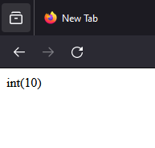

### Analisis
- Baris 1: Mendeklarasikan variabel $angka dengan nilai 10.
- Baris 2: Menggunakan var_dump untuk menampilkan informasi tentang variabel $angka.

### Kesimpulan Program
Program akan menampilkan int(10), yang berarti $angka adalah integer dengan nilai 10

## Looping (Perulangan)
### For
#### Penjelasan 
Looping `for` adalah salah satu konstruksi pengulangan yang digunakan dalam pemrograman untuk melakukan tugas-tugas yang berulang dengan cara yang terstruktur.
#### Struktur
```php
for (inisialisasi; kondisi; perubahan) {
    // Blok kode yang akan diulang
}
```

#### Kode program 
```php
for ($i = 1; $i <= 5; $i++) {
    echo $i . " ";
}
```

#### Hasil
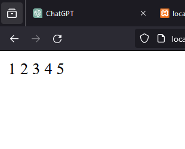

#### Analisis
1. `for (`: Ini menandakan dimulainya sebuah loop `for`.    
2. `$i = 1;`: Ini adalah inisialisasi variabel `$i` dengan nilai awal 1. Variabel ini akan digunakan sebagai penghitung loop.
3. `$i <= 5;`: Ini adalah kondisi perulangan. Loop akan terus berjalan selama nilai `$i` kurang dari atau sama dengan 5.
4. `$i++`: Ini adalah ekspresi increment. Setiap kali loop selesai dieksekusi, nilai variabel `$i` akan bertambah satu.
5. `) {`: Ini menandakan akhir dari bagian inisialisasi dan kondisi loop, serta awal dari blok kode yang akan diulang.
6. `echo $i . " ";`: Ini adalah bagian dari blok kode yang akan diulang. Pada setiap iterasi, nilai variabel `$i` akan dicetak ke layar, diikuti dengan spasi.
7. `}`: Ini menandakan akhir dari blok kode yang akan diulang.

#### Kesimpulan
Jadi, loop ini akan mencetak angka dari 1 hingga 5, dengan setiap angka dipisahkan oleh spasi.

### While
#### Penjelasan
Perulangan `while` adalah jenis perulangan yang digunakan untuk mengulang blok kode selama suatu kondisi bernilai `true`.
#### Struktur
```php
while (kondisi) {
    // Blok kode yang akan diulang
}
```
#### Kode program
```php
$i = 1;
while ($i <= 10) {
    echo $i . " ";
    $i++;
}
```
#### Hasil
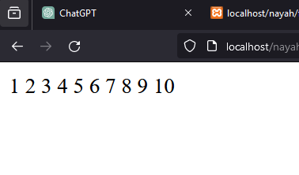
#### Analisis
1. `$i = 1;`: Ini adalah inisialisasi variabel `$i` dengan nilai 1. Variabel `$i` digunakan sebagai penghitung iterasi dalam loop.
2. `while ($i <= 10) {`: Ini adalah struktur loop `while`. Ini berarti bahwa selama kondisi dalam tanda kurung kurang dari atau sama dengan 10, blok kode dalam kurung kurawal akan terus dieksekusi.
3. `echo $i . " ";`: Ini mencetak nilai variabel `$i` diikuti oleh spasi ke layar. Variabel `$i` adalah penghitung iterasi, jadi nilai akan mulai dari 1 dan bertambah setiap kali loop dieksekusi.
4. `$i++;`: Ini adalah langkah iterasi di dalam loop. Setiap kali loop dieksekusi, nilai variabel `$i` akan bertambah satu.
#### Kesimpulan
Jadi, kode tersebut akan mencetak angka dari 1 hingga 10 ke layar, dipisahkan oleh spasi. Setelah mencapai 10, kondisi `$i <= 10` tidak lagi terpenuhi, dan loop berhenti.

### Do While
#### Penjelasan
Perulangan `do-while` adalah jenis perulangan yang digunakan untuk mengulang blok kode setidaknya satu kali, dan akan terus mengulang selama suatu kondisi bernilai `true`.
#### Struktur
```php
do {
    // Blok kode yang akan diulang
} while (kondisi);
```
#### Kode program
```php
$i = 1;
do {
    echo $i . " ";
    $i++;
} while ($i <= 20);
```
#### Hasil
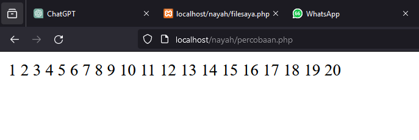
#### Analisis
1. `<?php` dan `?>` menandakan awal dan akhir dari blok kode PHP.
2. `$i = 1;` ini adalah inisialisasi variabel `$i` dengan nilai 1. Variabel ini akan digunakan untuk melacak nilai saat ini dalam perulangan.
3. `do { ... } while ($i <= 20);`: Ini adalah konstruksi perulangan do-while. Ini berarti kode dalam blok kurung kurawal `{}` akan dieksekusi sekali terlepas dari apapun. Setelah itu, kondisi yang diperiksa adalah `$i <= 20`. Jika kondisi ini benar (true), blok kode akan diulang kembali.
4. `echo $i . " ";`: Ini mencetak nilai variabel `$i` diikuti oleh spasi. Ini akan mencetak nilai variabel `$i` yang saat ini diinisialisasi pada 1.
5. `$i++;`: Ini adalah operasi peningkatan yang meningkatkan nilai variabel `$i` sebesar 1 setiap kali blok kode dijalankan. Dengan demikian, nilai `$i` akan bertambah setiap kali blok kode diulang.
#### Kesimpulan
Jadi, secara keseluruhan, kode ini akan mencetak angka dari 1 hingga 20, satu per satu, dipisahkan oleh spasi. Setelah mencetak angka 20, perulangan akan berhenti karena nilai `$i` akan menjadi 21, dan kondisi `while ($i <= 20)` tidak lagi benar.

### Foreach
#### Penjelasan
Perulangan `foreach` digunakan khusus untuk mengulang elemen-elemen dalam sebuah array atau objek.
#### Struktur
```php
foreach ($arrayOrObjek as $nilai) {
    // Blok kode yang akan diulang
}
```
#### Kode program
```php
$angka = array(1, 2, 3, 4, 5, 6, 7, 8, 9);
foreach ($angka as $nilai) {
    echo $nilai . " ";
}
```
#### Hasil
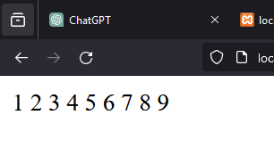
#### Analisis
1. `$angka = array(1, 2, 3, 4, 5, 6, 7, 8, 9);`: Pada baris ini, kita mendefinisikan sebuah array dengan nama `$angka` yang berisi bilangan dari 1 hingga 9.
2. `foreach ($angka as $nilai) {`: Ini adalah struktur `foreach` dalam PHP. Ini berarti untuk setiap elemen dalam array `$angka`, kita beri nama variabel sementara `$nilai` untuk mengakses nilai setiap elemen tersebut.
3. `echo $nilai . " ";`: Dalam setiap iterasi, nilai dari elemen array yang sedang diproses disimpan dalam variabel `$nilai`, dan kemudian dicetak menggunakan perintah `echo`. Tambahkan spasi setelah nilai untuk memisahkan nilai-nilai yang dicetak.
#### Kesimpulan
Jadi, secara keseluruhan, kode ini akan mencetak setiap nilai dalam array `$angka` dengan spasi sebagai pemisah. 

## Function
#### Penjelasan
`Funtion` adalah blok kode yang terpisah dan dapat dipanggil secara berulang untuk melakukan tugas tertentu. Fungsi membantu memecah program menjadi bagian-bagian yang lebih kecil dan terorganisir, sehingga memudahkan pemeliharaan dan pengembangan kode. Dalam PHP, fungsi dapat menerima argumen sebagai input dan mengembalikan nilai sebagai output.
#### Struktur
```php
function nama_fungsi($parameter1, $parameter2, ...) {
    // kode yang akan dieksekusi ketika fungsi dipanggil
    // bisa melakukan berbagai operasi di sini
    return $nilai_yang_dikembalikan; // opsional, hanya jika fungsi mengembalikan nilai
}
```
#### Kode program 
```php
function tambah($a, $b) {
    $hasil = $a + $b;
    return $hasil;
}

// Memanggil fungsi
$hasil_penambahan = tambah(5, 3);
echo "Hasil penambahan: " . $hasil_penambahan; // Output: Hasil penambahan: 8
```
#### Hasil
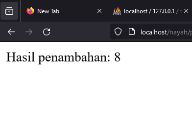
#### Analisis
1. Fungsi `tambah($a, $b)` mengambil dua parameter, `$a` dan `$b`, yang mewakili dua angka yang akan dijumlahkan.
2. Di dalam fungsi, kedua parameter tersebut dijumlahkan menggunakan operator `+` dan hasilnya disimpan dalam variabel `$hasil`.
3. Fungsi mengembalikan nilai dari variabel `$hasil` menggunakan pernyataan `return`.
4. Ketika fungsi dipanggil dengan `tambah(5, 3)`, nilai 5 dan 3 disematkan ke dalam parameter `$a` dan `$b` secara berturut-turut. Hasil penjumlahan dari kedua nilai ini adalah 8.
5. Hasil penjumlahan tersebut kemudian disimpan dalam variabel `$hasil_penambahan`.
6. Pada akhirnya, nilai dari `$hasil_penambahan` dicetak menggunakan pernyataan `echo` untuk menampilkan output "Hasil penambahan: 8".
#### Kesimpulan
Fungsi `tambah($a, $b)` adalah sebuah fungsi sederhana yang menerima dua parameter, `$a` dan `$b`, yang kemudian akan menjumlahkan kedua nilai tersebut dan mengembalikan hasil penjumlahannya.

Pada saat pemanggilan fungsi dengan `tambah(5, 3)`, parameter pertama (`$a`) akan bernilai 5 dan parameter kedua (`$b`) akan bernilai 3. Kemudian, dalam fungsi, kedua nilai ini dijumlahkan menggunakan operator `+`, dan hasilnya disimpan dalam variabel `$hasil`. Setelah itu, nilai `$hasil` dikembalikan menggunakan pernyataan `return`.

Kemudian, hasil penjumlahan tersebut disimpan dalam variabel `$hasil_penambahan` ketika fungsi dipanggil, dan digunakan untuk mencetak output "Hasil penambahan: 8" menggunakan pernyataan `echo`.

## PHP Form
### ### GET Method
#### Penjelasan
Metode GET digunakan untuk mengirimkan data form ke server dalam URL. Data form akan terlihat pada URL dan cocok untuk digunakan dalam kasus-kasus di mana data yang dikirimkan tidak sensitif.

#### Struktur program
```html
<form action="proses.php" method="get"> 
<label for="nama">Nama:</label>
<input type="text" id="nama" name="nama">
<br>     
<label for="email">Email:</label>
<input type="email" id="email" name="email">
<br> 
<input type="submit" value="Submit">
</form>
```
#### Kode Program 
```php
<!DOCTYPE html>

<html lang="en">

  

<head>

    <title>Document</title>

</head>

  

<body>

    <!-- Pada atribut action, kalian tuliskan nama file php yang bertugas untuk mengelola atau menangkap data dari form tersebut. -->

    <form action="proses_get.php" method="GET">

        <input type="text" name="nama" placeholder="Masukkan nama">

        <input type="number" name="umur" placeholder="Masukkan umur"> <br>

        <button type="submit">Kirim</button>

    </form>

</body>

  

</html>
```

```php
<?php

// Key dari array-nya, sesuai dengan nama dari atribut name di setiap input-nya

$nama = $_GET["nama"];

$umur = $_GET["umur"];

?>

  

<!DOCTYPE html>

<html lang="en">

  

<head>

    <meta charset="UTF-8">

    <meta name="viewport" content="width=device-width, initial-scale=1.0">

    <title> XI RPL 1 </title>

</head>

  

<body>

    <p>Nama anda

        <!-- Ini adalah versi singkatnya dari php echo,

             yang fungsinya untuk menampilkan data -->

        <?= $nama ?>

    </p>

    <p>Umur anda <?= $umur ?> tahun</p>

</body>

  

</html>
```

### Hasil
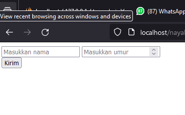

#### Analisis
1. `<?php ... ?>` adalah tag pembuka dan penutup untuk kode PHP
2. `$_GET["nama"]` dan `$_GET["umur"]` adalah superglobal array di PHP yang digunakan untuk mengakses data yang dikirimkan melalui URL dengan metode GET.
3. Contoh URL: `http://example.com?nama=John&umur=25`        - `$_GET["nama"]` akan berisi `John`
- `$_GET["umur"]` akan berisi `25`
4. `<!DOCTYPE html>` adalah deklarasi yang mendefinisikan dokumen ini sebagai dokumen HTML5.
5. `<html lang="en">` adalah tag pembuka HTML dengan atribut `lang` yang menunjukkan bahasa utama dokumen adalah Inggris.
6. `<head>` adalah bagian dari HTML yang berisi metadata tentang dokumen.
7. `<meta charset="UTF-8">` menentukan karakter encoding dokumen sebagai UTF-8.  
8. `<meta name="viewport" content="width=device-width, initial-scale=1.0">` membuat halaman web responsif, mengatur lebar viewport sesuai dengan lebar perangkat.
9. `<title> XI RPL 1 </title>` menentukan judul halaman yang akan ditampilkan pada tab browser.
10. `<body>` adalah bagian dari HTML yang berisi konten utama yang akan ditampilkan di browser.
11. `<p>Nama anda <?= $nama ?></p>` menampilkan nama yang diambil dari parameter URL.
12. `<?= $nama ?>` adalah singkatan dari `<?php echo $nama; ?>`, yang digunakan untuk menampilkan nilai variabel `$nama`.
13. `<p>Umur anda <?= $umur ?> tahun</p>` menampilkan umur yang diambil dari parameter URL.

#### Kesimpulan Program
Jika form diisi dan dikirim, halaman proses.php akan mencetak nama dan email yang diisi dalam form.

### POST Method
#### Penjelasan
Metode POST digunakan untuk mengirimkan data form ke server dalam bentuk tersembunyi. Data form tidak akan terlihat pada URL dan cocok untuk digunakan dalam kasus-kasus di mana data yang dikirimkan sensitif.

#### Struktur program
```html
<form action="proses.php" method="post">     
<label for="nama">Nama:</label> 
<input type="text" id="nama" name="nama">
<br>  
<label for="email">Email:</label>  
<input type="email" id="email" name="email">
<br>  
<input type="submit" value="Submit"> 
</form>
```

#### Kode Program
```php
   <!DOCTYPE html>

<html lang="en">

  

<head>

    <title>Document</title>

</head>

  

<body>

    <!-- Pada atribut action, kalian tuliskan nama file php yang bertugas untuk mengelola atau menangkap data dari form tersebut. -->

    <form action="proses_post.php" method="POST">

        <input type="text" name="nama_lengkap" placeholder="Masukkan nama">

        <input type="number" name="umur" placeholder="Masukkan umur">

        <input type="password" name="password" placeholder="Masukkan password"><br>

        <button type="submit">Kirim</button>

    </form>

</body>

  

</html>    
```

```php
<?php

// Key dari array-nya, sesuai dengan nama dari atribut name di setiap input-nya

//$nama = $_POST["nama"];

$umur = $_POST["umur"];

?>

  

<!DOCTYPE html>

<html lang="en">

  

<head>

    <title> XI RPL 1 - POST</title>

</head>

  

<body>

    <p>Nama anda <?= $_POST["nama_lengkap"] ?></p>

    <p>Umur anda <?= $umur ?> tahun</p>

    <p>Password anda aman!</p>

</body>

  

</html>
```

### Hasil
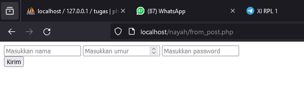
#### Analisis
1.  `<?php ... ?>` adalah tag pembuka dan penutup untuk kode PHP.
2. `//` adalah komentar di PHP, artinya `//$nama = $_POST["nama"];` tidak akan dieksekusi.
3. `$_POST["umur"]` adalah superglobal array di PHP yang digunakan untuk mengakses data yang dikirimkan melalui form dengan metode POST.
4. Variabel `$umur` mengambil nilai dari input dengan nama `umur` yang dikirimkan melalui POST.
5. `<!DOCTYPE html>` adalah deklarasi yang mendefinisikan dokumen ini sebagai dokumen HTML5.
6. `<html lang="en">` adalah tag pembuka HTML dengan atribut `lang` yang menunjukkan bahasa utama dokumen adalah Inggris
7. `<head>` adalah bagian dari HTML yang berisi metadata tentang dokumen.
8. `<title> XI RPL 1 - POST</title>` menentukan judul halaman yang akan ditampilkan pada tab browser.
9. `<body>` adalah bagian dari HTML yang berisi konten utama yang akan ditampilkan di browser.
10. `<p>Nama anda <?= $_POST["nama_lengkap"] ?></p>` menampilkan nama lengkap yang diambil dari parameter POST.    
11. `<?= $_POST["nama_lengkap"] ?>` adalah singkatan dari `<?php echo $_POST["nama_lengkap"]; ?>`, yang digunakan untuk menampilkan nilai dari `$_POST["nama_lengkap"]`.
12. `<p>Umur anda <?= $umur ?> tahun</p>` menampilkan umur yang diambil dari parameter POST.
13. `<p>Password anda aman!</p>` adalah teks statis yang ditampilkan pada halaman, menunjukkan bahwa password aman (meskipun dalam kasus nyata, informasi tentang password tidak seharusnya ditampilkan di halaman).
#### Kesimpulan Program
Program akan mencetak nama dan email yang diisi dalam form setelah form dikirim dengan metode POST
