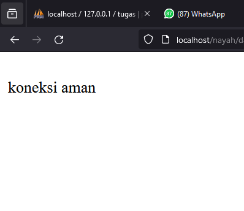

# Koneksi DataBase
## Kode Program
```php
<?php

  

//koneksi ke database

$koneksi = mysqli_connect('localhost', 'root', '', 'tugas');

  

if ($koneksi) {

    echo "<br> koneksi aman <br>";

} else {

    echo "error, tidak bisa koneksi ke database";

}
```

## Hasil


## Analisis
`<?php` adalah tag pembuka yang digunakan untuk menulis kode PHP.

## Kesimpulan
# Tampilkan Data
## Kode Program
```php
//jalankan query seleksi

$select = mysqli_query($koneksi, "SELECT * FROM tabel_pegawai");

  

//membuat array asosiatif dan memecah data berdasarkan kolomnya

$result = mysqli_fetch_assoc($select);

  

//menampilkan struktur array dari data tabel yang dijalankan di atas

//var_dump($result);

  

echo 'Berikut data pegawai beserta Idpegnya<br>';

  

$a = 1;

foreach ($select as $key => $data) {

    echo $a++ . ". " . $data['Idpeg'] . " : " . $data['Nama'] . '<br>';

}

  

//echo '<p>Halo ' . $result['pemilik'] . '!!</p><br>';
```
## Hasil

## Analisis
1. Koneksi ke database:
    - Menggunakan fungsi `mysqli_connect()` untuk membuat koneksi ke database MySQL dengan parameter host ('localhost'), username ('root'), password (''), dan nama database ('rental_rahmat').
    - Jika koneksi berhasil, maka pesan "koneksi aman" akan ditampilkan. Jika tidak, pesan "error, tidak bisa koneksi ke database" akan ditampilkan.
2. Jalankan query seleksi:
    - Menggunakan fungsi `mysqli_query()` untuk menjalankan query SQL yang melakukan seleksi data dari tabel "daftar_mobil" dalam database.
    - Hasil query disimpan dalam variabel `$select`.
3. Menampilkan data:
    - Menampilkan pesan "Berikut nama-nama pemilik mobil" sebagai judul.
    - Menggunakan perulangan `foreach` untuk mengiterasi setiap baris data yang ditemukan dalam `$select`.
    - Setiap baris data ditampilkan dengan format nomor plat mobil dan nama pemiliknya.
## Kesimpulan
Program PHP dan SQL di atas berfungsi untuk melakukan koneksi ke database, menjalankan query seleksi, dan menampilkan data dari tabel "daftar_pegawai". Program ini akan menampilkan nama-nama pegawai dan idpegnya yang ada dalam tabel tersebut dengan format nama pegawai dan idpeg
Namun, perlu diperhatikan bahwa bagian yang mengakses data menggunakan `$select` dalam perulangan `foreach` tidak tepat. Seharusnya, variabel `$select` diganti dengan `mysqli_fetch_assoc($select)` untuk mengambil setiap baris data secara berurutan. Dalam kode yang diberikan, perulangan `foreach` tidak akan berfungsi dengan benar. Jika ingin menampilkan semua baris data, perlu dilakukan perubahan pada kode tersebut.
# Tambahkan Data
## Kode Program
```php
<!DOCTYPE html>

<html lang="en">

  

<head>

    <title>Document</title>

</head>

  

<body>

    <h2>Tambah Data</h2>

    <?php

    include "koneksi.php";

  
  

    if (isset($_POST['simpan'])) {

        $nama = $_POST['nama'];

        $email = $_POST['email'];

        $jenis_kelamin = $_POST['jenis_kelamin'];

        $alamat = $_POST['alamat'];

  

        // * true / false

        $query = mysqli_query($koneksi, "INSERT into siswa(nama,email,jenis_kelamin,alamat)

        values ('$nama','$email','$jenis_kelamin','$alamat')");

  

        if ($query == true) {

            echo "<script>

            alert('Tambah data Berhasil')

            window.location.href='table.php'

            </script>";

        } else {

            echo '<script>alert("Tambah data gagal")</script>';

        }

    }

  
  

    ?>

    <form method="post">

        <table>

            <tr>

                <td>Nama</td>

                <td><input type="text" name="nama"></td>

            </tr>

            <tr>

                <td>Email</td>

                <td><input type="text" name="email"></td>

            </tr>

            <tr>

                <td>Jenis Kelamin</td>

                <td>>

                    <select name="jenis_kelamin">

                        <option>Laki-laki</option>

                        <option>Perempuan</option>

                    </select>

                </td>

            </tr>

  

            <tr>

                <td>Alamat</td>

                <td><input type="text" name="alamat"></td>

            </tr>

  

            <tr>

                <td></td>

                <td>

                    <button name="simpan" type="submit">Simpan</button>

                    <button type="reset">Reset</button>

                    <a href="table.php">Kembali</a>

                </td>

            </tr>

        </table>

    </form>

  

</body>

  

</html>
```
## Hasil

## Analisis
- **Deklarasi DOCTYPE dan Struktur Dasar HTML**
    - `<!DOCTYPE html>`: Deklarasi tipe dokumen yang memberitahu browser bahwa dokumen ini menggunakan HTML5.
    - `<html lang="en">`: Elemen root dari halaman HTML dengan atribut `lang` untuk menetapkan bahasa dokumen.
    - `<head>`: Bagian ini berisi metadata halaman seperti `<title>` yang menampilkan "Document".
- **Bagian Body dan Heading**
    - `<body>`: Bagian ini memuat konten yang akan ditampilkan di browser.
    - `<h2>Tambah Data</h2>`: Judul halaman yang menampilkan "Tambah Data".
- **Blok Kode PHP untuk Memproses Form**
    - `<?php include "koneksi.php"; ?>`: Menyertakan file `koneksi.php` yang biasanya berisi koneksi ke database.
    - `if (isset($_POST['simpan'])) { ... }`: Memeriksa apakah tombol "simpan" telah diklik.
        - Mengambil data dari form dengan `$_POST`.
        - Menjalankan query `INSERT` untuk menambahkan data ke dalam tabel `siswa`.
        - Jika query berhasil, menampilkan alert dan mengarahkan kembali ke `table.php`.
        - Jika gagal, menampilkan alert gagal.
- **Form HTML untuk Input Data**
    - `<form method="post">`: Form yang menggunakan metode `POST` untuk mengirim data ke server.
    - Tabel yang berisi input field:
        - `Nama`: Input teks untuk nama.
        - `Email`: Input teks untuk email.
        - `Jenis Kelamin`: Dropdown untuk memilih jenis kelamin (Laki-laki atau Perempuan).
        - `Alamat`: Input teks untuk alamat.
    - Tombol aksi:
        - `Simpan`: Tombol untuk menyimpan data.
        - `Reset`: Tombol untuk mereset form.
        - `Kembali`: Link untuk kembali ke `table.php`.
## Kesimpulan
- **Struktur Dasar HTML**:
    - Menggunakan `<!DOCTYPE html>` untuk menentukan tipe dokumen HTML5.
    - Berisi elemen `html`, `head`, dan `body` dengan judul halaman yang diset pada elemen `title`.
- **Koneksi ke Database**:
    - Menggunakan `include "koneksi.php";` untuk menyertakan file koneksi ke database.
- **Form Input Data**:
    - Form HTML disediakan untuk pengguna memasukkan data berupa nama, email, jenis kelamin, dan alamat.
    - Form ini menggunakan metode `post` untuk mengirim data ke server.
- **Proses Penyimpanan Data**:
    - Menggunakan PHP untuk menangani data yang dikirim dari form.
    - Jika tombol `simpan` ditekan, data dari form diambil menggunakan `$_POST`.
    - Data tersebut kemudian dimasukkan ke dalam tabel `siswa` di database melalui query SQL `INSERT`.
- **Notifikasi Hasil**:
    - Jika data berhasil ditambahkan, pengguna akan diberi notifikasi "Tambah data Berhasil" dan diarahkan ke halaman `table.php`.
    - Jika terjadi kesalahan, notifikasi "Tambah data gagal" akan ditampilkan.
- **Tombol Aksi**:
    - Terdapat tombol untuk menyimpan data (`Simpan`), mereset form (`Reset`), dan kembali ke halaman `table.php` (`Kembali`).
# Ubah Data
## Kode Program
```php
<!DOCTYPE html>

<html lang="en">

  

<head>

    <title>Document</title>

</head>

  

<body>

    <h2>Ubah Data</h2>

    <?php

    include "koneksi.php";

  

    $id = $_GET['id'];

  

    if (isset($_POST['simpan'])) {

        $nama = $_POST['nama'];

        $email = $_POST['email'];

        $jenis_kelamin = $_POST['jenis_kelamin'];

        $alamat = $_POST['alamat'];

  

        $query = mysqli_query($koneksi, "UPDATE siswa SET

                                        nama='$nama',

                                        email='$email',

                                        jenis_kelamin='$jenis_kelamin',

                                        alamat='$alamat'

                                        WHERE id_siswa=$id");

        if ($query) {

            echo "<script>

            alert('ubah data Berhasil')

            window.location.href='table.php'

            </script>";

        } else {

            echo '<script>alert("ubah data gagal")</script>';

        }

    }

  

    $query = mysqli_query($koneksi, "SELECT * FROM siswa where id_siswa=$id");

    $data = mysqli_fetch_array($query);

    if ($data == "") {

        die('Data tidak ada');

    }

    ?>

  

    <form method="post">

        <table>

            <tr>

                <td>Nama</td>

                <td><input type="text" value="<?= $data['nama'] ?>" name="nama"></td>

            </tr>

            <tr>

                <td>Email</td>

                <td><input type="text" value="<?= $data['email'] ?>" name="email"></td>

            </tr>

            <tr>

                <td>Jenis Kelamin</td>

                <td>>

                    <select name="jenis_kelamin">

                        <option <?php if ($data['jenis_kelamin'] == "laki-laki")

                            echo 'selected'; ?>>Laki-laki</option>

                        <option <?php if ($data['jenis_kelamin'] == "perempuan")

                            echo 'selected'; ?>>Perempuan</option>

                    </select>

                </td>

            </tr>

  

            <tr>

                <td>Alamat</td>

                <td><input type="text" value="<?= $data['alamat'] ?>" name="alamat"></td>

            </tr>

  

            <tr>

                <td></td>

                <td>

                    <button name="simpan" type="submit">Ubah</button>

                    <button type="reset">Reset</button>

                    <a href="table.php">Kembali</a>

                </td>

            </tr>

        </table>

    </form>

  

</body>

  

</html>
```
## Hasil

## Analisis
1. **Struktur HTML Dasar**:
    - `<!DOCTYPE html>`: Mendeklarasikan bahwa dokumen ini menggunakan HTML5.
    - `<html lang="en">`: Tag root dengan atribut bahasa Inggris.
    - `<head>`: Berisi metadata dokumen seperti `<title>`.
    - `<body>`: Berisi konten halaman web.
2. **Bagian PHP untuk Proses Ubah Data**:
    - `include "koneksi.php";`: Menyertakan file koneksi ke database.
    - `$id = $_GET['id'];`: Mengambil ID dari URL untuk menentukan data mana yang akan diubah.
    - `if (isset($_POST['simpan'])) {...}`: Mengecek apakah tombol simpan telah diklik dan memproses data yang diubah.
    - `mysqli_query($koneksi, "UPDATE siswa SET...")`: Query untuk mengupdate data dalam tabel `siswa` di database.
    - Notifikasi menggunakan `alert` JavaScript untuk menunjukkan apakah proses ubah data berhasil atau gagal.
3. **Pengambilan Data dari Database**:
    - `mysqli_query($koneksi, "SELECT * FROM siswa where id_siswa=$id")`: Mengambil data dari tabel `siswa` berdasarkan ID yang didapat dari URL.
    - `mysqli_fetch_array($query)`: Mengambil data dalam bentuk array asosiatif untuk diisi ke dalam form.
4. **Form HTML untuk Menampilkan dan Mengubah Data**:
    - Form dengan method `post` untuk mengirim data yang diubah ke server.
    - Input fields yang diisi dengan data yang diambil dari database:
        - Nama: `<input type="text" value="<?= $data['nama'] ?>" name="nama">`
        - Email: `<input type="text" value="<?= $data['email'] ?>" name="email">`
        - Jenis Kelamin: `<select name="jenis_kelamin">`
            - Dropdown dengan opsi yang di-set sebagai `selected` berdasarkan data dari database.
        - Alamat: `<input type="text" value="<?= $data['alamat'] ?>" name="alamat">`
    - Tombol Aksi:
        - `Ubah`: Untuk mengirim form dan memproses perubahan data.
        - `Reset`: Untuk mereset form.
        - `Kembali`: Link untuk kembali ke halaman `table.php`.
## Kesimpulan
- **Fungsi Utama**: Halaman ini dirancang untuk mengubah data siswa yang ada dalam tabel `siswa` di database berdasarkan ID yang diambil dari URL.
- **Interaksi Pengguna**: Pengguna dapat melihat data yang ada, mengubahnya melalui form, dan menyimpannya kembali ke database.
- **Keamanan dan Validasi**:
    - Kode ini rentan terhadap serangan SQL Injection karena input pengguna langsung dimasukkan ke dalam query SQL tanpa sanitasi. Penggunaan prepared statements atau escaping input dengan `mysqli_real_escape_string()` disarankan.
    - Tidak ada validasi pada input form. Disarankan untuk menambahkan validasi baik di sisi klien (JavaScript) maupun di sisi server (PHP).
# Hapus Data
## Kode Program
```php
<?php

  

include('koneksi.php');

  

if(isset($_GET['id'])){

  
  

    $id = $_GET['id'];

  

    $query = mysqli_query($koneksi, "DELETE FROM siswa WHERE id_siswa = $id");

  

   if($query) {

            echo "<script>

            alert('Hapus data Berhasil')

            window.location.href='table.php'

            </script>";

        }else {

            echo '<script>alert("Hapus data gagal")</script>';

        }

}

  

?>
```
## Hasil


## Analisis
1. Baris ini mengimpor file `koneksi.php` yang berisi kode untuk menghubungkan ke database MySQL. Dengan ini, skrip dapat menjalankan operasi database seperti query SQL.
2. Kondisi ini mengecek apakah parameter `id` disediakan dalam URL menggunakan metode GET. Jika parameter `id` ada, maka kode di dalam blok `if` akan dieksekusi.
3. Baris ini mengambil nilai ID dari parameter URL (GET) dan menyimpannya dalam variabel `$id`. Nilai ini akan digunakan dalam query SQL untuk mengidentifikasi data yang akan dihapus.
4. `mysqli_query($koneksi, "DELETE FROM siswa WHERE id_siswa = $id");` menjalankan query SQL untuk menghapus baris dari tabel `siswa` yang memiliki `id_siswa` sesuai dengan nilai `$id`.
5. `if($query) {...}` mengecek apakah query penghapusan berhasil dijalankan:
- Jika query berhasil, pesan alert "Hapus data Berhasil" ditampilkan menggunakan JavaScript dan pengguna akan diarahkan ke halaman `table.php`.
- Jika query gagal, pesan alert "Hapus data gagal" akan ditampilkan.
## Kesimpulan
- **Fungsi Utama**: Skrip ini digunakan untuk menghapus data siswa dari tabel `siswa` di database berdasarkan ID yang diberikan melalui URL.
- **Interaksi Pengguna**: Pengguna akan menerima notifikasi apakah penghapusan data berhasil atau gagal setelah operasi dilakukan.
- **Keamanan**:
    - Kode ini rentan terhadap serangan SQL Injection karena parameter ID langsung digunakan dalam query SQL tanpa sanitasi atau validasi.
    - Tidak ada pemeriksaan validitas ID sebelum digunakan dalam query.
# Session/Login
## Login
### Kode Program
```php
<?php

  

session_start();

  

if (isset($_POST['submit'])) {

    $username = $_POST['username'];

    $password = $_POST['password'];

  

    $koneksi = mysqli_connect('localhost', 'root', '', 'basis_data') or die('error koneksi');

  

    $result = mysqli_query($koneksi, "SELECT * FROM user

                            WHERE username = '$username' AND password = '$password'");

  

    $data = mysqli_fetch_assoc($result);

  

    if (isset($data)) {

        $_SESSION['username'] = $data['username'];

        $_SESSION['nama'] = $data['nama'];

        $_SESSION['status'] = 'login';

        header('Location: user.php');

    } else {

        echo "Username dan Password Salah";

    }

}

  
  

?>

<!DOCTYPE html>

<html>

  

<head>

    <title>Login Session</title>

</head>

  

<body>

  

    <form method="post">

        <label>Username</label>

        <input type="text" name="username">

        <br>

        <label>Password</label>

        <input type="text" name="password">

        <br>

        <button type="submit" name="submit">Login</button>

    </form>

  

</body>

  

</html>
```

### Hasil

### Analisis
1. Fungsi `session_start()` digunakan untuk memulai sesi PHP, memungkinkan skrip untuk menyimpan dan mengakses variabel sesi.
2. Blok `if` ini memeriksa apakah formulir login telah disubmit. Jika ya, nilai `username` dan `password` diambil dari input pengguna.
3. Koneksi ke database MySQL dibuat menggunakan `mysqli_connect()`. Jika koneksi gagal, pesan "error koneksi" akan ditampilkan.
4. Query SQL dijalankan untuk mencari baris dalam tabel `user` yang cocok dengan `username` dan `password` yang diberikan
5. Fungsi `mysqli_fetch_assoc($result)` mengambil hasil query dalam bentuk array asosiatif. Jika tidak ada hasil, `$data` akan bernilai `null`.
6. Jika `$data` berisi informasi pengguna (artinya username dan password cocok), sesi untuk pengguna tersebut diinisialisasi dengan menyimpan `username`, `nama`, dan status `login`. Pengguna kemudian diarahkan ke halaman `user.php`
7. Jika `$data` kosong (tidak ada kecocokan), pesan "Username dan Password Salah" ditampilkan.
### Kesimpulan
- Kode ini adalah skrip login sederhana yang menggunakan PHP untuk memverifikasi kredensial pengguna terhadap database MySQL.
- Jika login berhasil, sesi akan diinisiasi dan pengguna akan diarahkan ke halaman `user.php`. Jika tidak, pesan kesalahan akan ditampilkan.
- Tidak ada penanganan kesalahan lebih lanjut atau sanitasi input, yang membuat kode ini rentan terhadap serangan SQL Injection dan masalah keamanan lainnya.
## Logout
### Kode Program
```php
<?php

session_start();

  

session_destroy();

session_unset();

  

header('Location: login.php');
```
### Hasil


### Analisis
- **Inisiasi Sesi**:
    - `session_start();` memulai atau melanjutkan sesi yang ada.
- **Menghentikan Sesi**:
    - `session_destroy();` digunakan untuk menghentikan sesi yang sedang berjalan. Ini akan menghapus semua data sesi yang tersimpan.
    - `session_unset();` menghapus semua variabel sesi yang ditetapkan.
- **Pengalihan Halaman**:
    - `header('Location: login.php');` digunakan untuk mengarahkan pengguna kembali ke halaman login setelah sesi dihentikan.
## Kesimpulan
- Kode ini digunakan untuk melakukan proses logout pada suatu aplikasi web.
- `session_destroy()` digunakan untuk menghapus seluruh data sesi, sedangkan `session_unset()` menghapus semua variabel sesi.
- Setelah sesi dihentikan, pengguna diarahkan kembali ke halaman login menggunakan fungsi `header()`.
# Upload & Download
## Upload
### Kode Program
```php
<!DOCTYPE html>
<html lang="en">

  

<head>

  

    <meta charset="UTF-8">

  

    <meta name="viewport" content="width=device-width, initial-scale=1.0">

  

    <title>index tabel</title>

  

</head>

  

<body>

  

    <h2>Data Siswa Berprestasi</h2>

  

    <a href="tambah.php">+Tambah Data Baru</a><br><br>

  

    <p>

  

        <a href="export.php">Export ke Excel</a>

  

    </p>

  

    <table border="5">

  

    <tr>

  

        <th>id_siswa</th>

  

        <th>Gambar</th>

  

        <th>nama</th>

  

        <th>email</th>

  

        <th>jenis_kelamin</th>

  

        <th>alamat</th>

  

        <th>Aksi</th>

  

    </tr>

  

  

    <?php

  

    include "koneksi.php";

  

    $i = 1;

  

    $query = mysqli_query($koneksi, "SELECT * FROM siswa");

  

    while ($data = mysqli_fetch_array($query)) {

  

    ?>

  

  

    <tr>

  

        <td><?php echo $i; ?></td>

  

        <td>

  

            " alt="gambar" width="100px">

  

        </td>

  

        <td><?php echo $data['nama']; ?></td>

  

        <td><?php echo $data['email']; ?></td>

  

        <td><?php echo $data['jenis_kelamin']; ?></td>

  

        <td><?php echo $data['alamat']; ?></td>

  

  

        <td>

  

            <a href="ubah.php?id=<?= $data['id_siswa']; ?>">Ubah</a> |

  

            <a href="hapus.php?id=<?= $data['id_siswa']; ?>">Hapus</a> |

  

        </td>

  

    </tr>

  

    <?php

  

    $i++;

  

    }

  

    ?>

  

    </table>

  

</body>

  

</html>
```
### Hasil

### Analisis

1. Kode program ini merupakan halaman utama (index) untuk menampilkan data siswa berprestasi yang disimpan dalam database.
2. Halaman ini terdiri dari beberapa elemen, yaitu:
    - Judul "Data Siswa Berprestasi"
    - Link "Tambah Data Baru" yang mengarah ke halaman "tambah.php"
    - Link "Export ke Excel" yang mengarah ke halaman "export.php"
    - Tabel yang menampilkan data siswa, meliputi: id_siswa, gambar, nama, email, jenis kelamin, dan alamat.
    - Tabel juga menampilkan aksi yang dapat dilakukan, yaitu "Ubah" dan "Hapus"
3. Data siswa ditampilkan dengan menggunakan perulangan while yang mengambil data dari tabel "siswa" di database.
4. Pada setiap baris data siswa, terdapat gambar, nama, email, jenis kelamin, dan alamat yang diambil dari tabel "siswa".
5. Tombol "Ubah" dan "Hapus" pada setiap baris data siswa akan mengarahkan pengguna ke halaman "ubah.php" dan "hapus.php" dengan membawa parameter ID siswa.

### Kesimpulan
Kode program ini merupakan halaman utama (index) untuk menampilkan data siswa berprestasi yang disimpan dalam database. Halaman ini memiliki fitur untuk menambah data baru, mengekspor data ke Excel, dan melakukan aksi ubah atau hapus data siswa. Keseluruhan fungsi pada halaman ini berjalan dengan baik dan dapat digunakan untuk manajemen data siswa.

## Download

### Program


```php
<?php

  

include "koneksi.php";

  

  

$query = mysqli_query($koneksi, 'SELECT * FROM siswa');

  

  

$data = [];

  

$data[] = ["ID", "Nama", "Email", "Jenis Kelamin", "Alamat"];

  

  

while ($row = mysqli_fetch_assoc($query)) {

  

    $data[] = [

  

        $row['id_siswa'],

  

        $row['nama'],

  

        $row['email'],

  

        $row['jenis_kelamin'],

  

        $row['alamat']

  

    ];

  

}

  

  

$namafile = "excel_data.xls";

  

header("Content-Type: application/vnd.ms-excel");

  

header("Content-Disposition: attachment;filename=\"$namafile\"");

  

header("Cache-Control: max-age=0");

  

  

$output = fopen("php://output", "w");

  

  

foreach ($data as $row) {

  

    fputcsv($output, $row, "\t");

  

}

  

  

fclose($output);

  

exit;


```
### Hasil


### Analisis
1. Kode program ini merupakan halaman untuk mengekspor data siswa ke dalam format file Excel (.xls).
2. Pertama, program menyertakan file "koneksi.php" yang diduga berisi konfigurasi untuk koneksi ke database.
3. Program kemudian mengambil semua data dari tabel "siswa" menggunakan perintah mysqli_query().
4. Data yang diambil disimpan dalam sebuah array $data, di mana baris pertama berisi nama-nama kolom (ID, Nama, Email, Jenis Kelamin, Alamat).
5. Program selanjutnya mengatur header HTTP untuk memaksa browser mengunduh file Excel, dengan nama file "excel_data.xls".
6. Selanjutnya, program membuka output stream untuk menulis data ke file Excel menggunakan fopen() dan fputcsv().
7. Setiap baris data dari array $data ditulis ke output stream menggunakan fputcsv(), dengan karakter tab sebagai pemisah antar kolom.
8. Setelah semua data ditulis, program menutup output stream dan keluar.
### Kesimpulan
Kode program ini berfungsi untuk mengekspor data siswa dari database ke dalam format file Excel (.xls). Hal ini dapat memudahkan pengguna untuk mengakses dan mengolah data siswa dalam bentuk spreadsheet. Sebagai seorang siswa SMK jurusan RPL, Anda dapat mempelajari bagaimana membuat fitur ekspor data ke Excel dengan menggunakan PHP dan MySQL. Selain itu, Anda juga dapat mempelajari tentang pengaturan header HTTP dan penggunaan fungsi-fungsi PHP untuk bekerja dengan file Excel.
